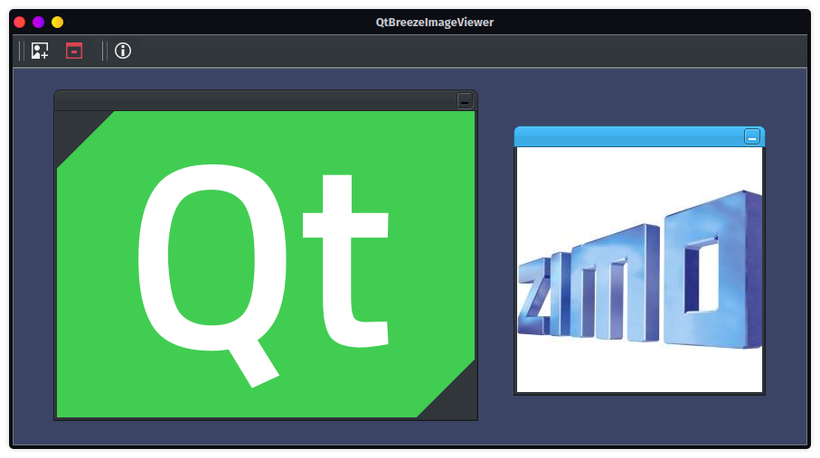

# QtBreeze


QtBreeze is a CMake wrapper for KDE's [breeze-icons](https://github.com/KDE/breeze-icons) and [BreezeStyleSheets](https://github.com/Alexhuszagh/BreezeStyleSheets). It combines both repositories into two seperate [Qt resource files](https://doc.qt.io/qt-5/resources.html#resource-collection-files-op-op-qrc), which can then be easily included in other Qt projects.

<details>
  <summary>Table of contents</summary>
  <ol>
    <li><a href="#getting-started">Getting started</a></li>
      <ul>
        <li><a href="#prerequisites">Prerequisites</a></li>
        <li><a href="#installation">Installation</a></li>
        <li><a href="#build">Build</a></li>
      </ul>
    <li><a href="#usage">Usage</a></li>
  </ol>
</details>

## Getting started
### Prerequisites
- C++17 compatible compiler
- [CMake](https://cmake.org/) ( >= 3.25 )

### Installation
This library is meant to be consumed with CMake.

```cmake
# Either by including it with CPM
cpmaddpackage("gh:ZIMO-Elektronik/QtBreeze@5.102.0")

# or the FetchContent module
FetchContent_Declare(
  DCC
  GIT_REPOSITORY https://github.com/ZIMO-Elektronik/QtBreeze
  GIT_TAG v5.102.0)

target_link_libraries(YourTarget PRIVATE QtBreeze::Icons QtBreeze::StyleSheets)
```

### Build
If the build is running as a top-level CMake project then a small example will be generated.
```sh
cmake -Bbuild
cmake --build build --target QtBreezeImageViewer
```



## Usage
In Qt resources in a library must be force initialized by calling the [Q_INIT_RESOURCE()](https://doc.qt.io/qt-5/qdir.html#Q_INIT_RESOURCE) macro with the base name of the .qrc file. As mentioned before icons and stylesheets come as seperate resource files. Those resource files are:
- qtbreeze_icons.qrc
- qtbreeze_stylesheets.qrc

Here is an example how to create a QIcon file from an icon in the resource system.
```cpp
Q_INIT_RESOURCE(qtbreeze_icons);
QIcon const open_icon{":/icons-dark/actions/16/document-open.svg"};
```

Here is an example how to apply a stylesheet from the resource system to a QApplication instance.
```cpp
QApplication app(argc, argv);
Q_INIT_RESOURCE(qtbreeze_stylesheets);
QFile file{":/dark/stylesheet.qss"};
file.open(QFile::ReadOnly | QFile::Text);
QTextStream stream{&file};
app.setStyleSheet(stream.readAll());
```

:warning: Be careful when using BreezeStyleSheets together with the [Qt Advanced Docking System](https://github.com/githubuser0xFFFF/Qt-Advanced-Docking-System). The dock managers internal stylesheet has to be disabled for BreezeStyleSheets to work correctly. This is done by setting the stylesheet to an empty string
```cpp
DockManager->setStyleSheet("");
```